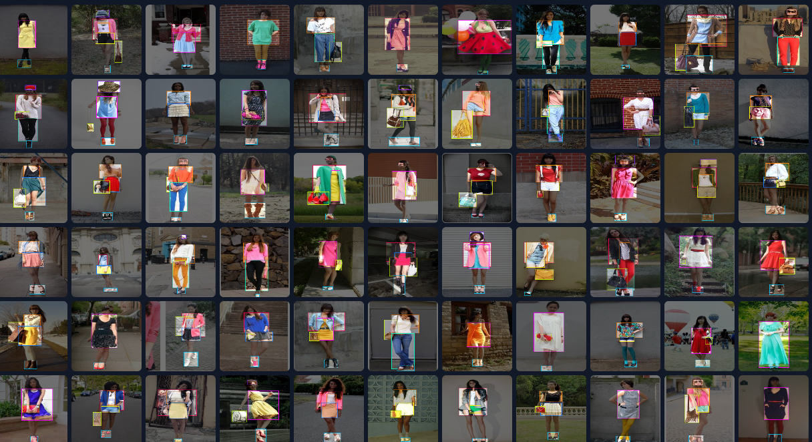
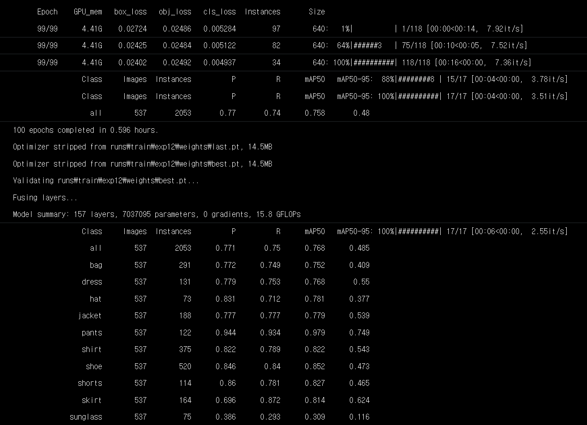
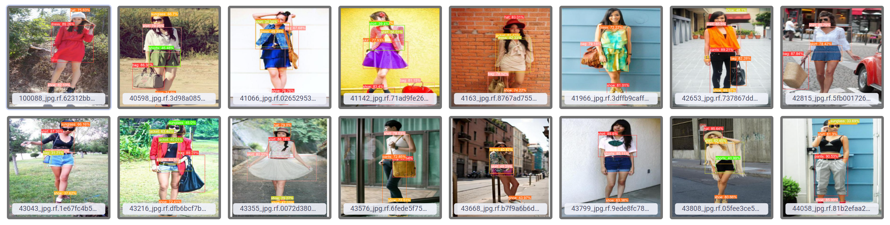

# :sparkles: Team : FATECT :sparkles:
* 20185118 김우정 
* 20185165 전진완
## :bulb: Project : Object Detection을 활용한 의류 탐지
Object Detection을 사용하여 영상에서 사람이 입은 옷을 탐지하여 의류 분류를 하고, 해당 옷을 선택하면 그와 관련된 옷을 추천해주는 서비스
## :hammer: Project Tool
* Python
* JavaScript
* OpenCV(Pytorch, YOLO)
## :books: Project Status
:heavy_check_mark: Fashion Data set labeling 
:heavy_check_mark: YOLO Dig Up 
:heavy_check_mark: GNN, CNN modeling 

## :construction::Tentative Result(2022/10/30)
* Custom Dataset

* Train YOLOv5

* Test Images

## :pushpin::Development Plan
* Data Set 추가로 수집하여 모델의 Object detection 성능 향상
* GNN을 사용한 Recommendation System 추가